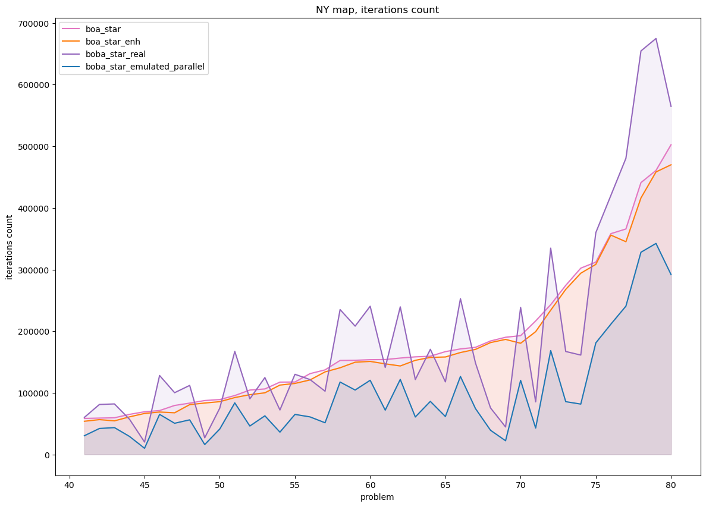
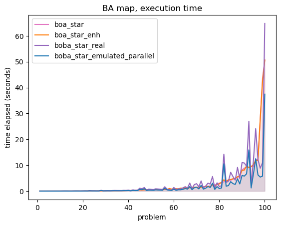

# Biobjective pathfinding (search for Pareto-optimal solutions) 🦕

In this project we are implementing a state-of-art algorithm for
bi-objective pathfinding - $BOBA^\*$, along with two other algorithms and $BOBA^\*$ predecessors -
$BOA^\*$ and $BOA^\*enh$

## Problem setting

The problem consists of a graph instance $(S, E)$, sometimes referred to as map, 
where $S$ is a set of all states in the graph and $E$ is the set of edges, start and goal states.
The graph is directed and has two cost functions ($cost_1$, $cost_2$) defined on its edges

Cost of a path is defined as a coordinate-wise sum of costs of all its edges

The goal is two find a set of pareto-optimal solutions $Sols$, 
that is such a set that for any other path $p'$ from start to goal
there exists a path $p \in Sols$, weakly dominating $p'$ by it's cost


In the example above, $Sols$ consists of a yellow path and a green path, 
and we can easily see that taking the blue path is both longer ($cost_1$) and slower ($cost_2$)
than taking, for example, the yellow one. Therefore, blue path is not included in $Sols$


## Algorithms

The algorithms implementations, as well as denotations are taken mainly
from the original [paper](https://arxiv.org/pdf/2105.11888.pdf)

For more detailed algorithms descriptions and pseudocode we recommend to look it over

### $BOA^\*$

$BOA^\*$ is an $A^\*$-based search algorithm, used to find a set of pareto-optimal solutions on a biobjective search graph.
Unlike previously invented algorithms, $BOA*$ only uses O(1) time to check pareto-optimality of a newly found path
in the search tree by initially sorting graph states in a specific order

Its realization is pretty simple and the pseudocode differs from $A^\*$ one only in two extra search stopping conditions, as you can see below


You can find this algorithm realization is in [boastar.py](boastar.py)

 
### $BOA^\*enh$

This algorithm is an enhancement of $BOA^\*$ and a main component of $BOBA^\*$. It optimizes $BOA^\*$, assuming that a different algorithm
work in parallel with it and updates some bound and heurustics. Without this different algorithm, $BOA^\*enh$ works just a little faster 
than simple $BOA^\*$

You can notice the difference between $BOA^\*enh$ and regular $BOA^\*$  in the red lines of the pseudocode below


The $BOA^*enh$ algorithm realization is in [bobastar.py](bobastar.py)

### $BOBA^\*$

The main purpose of this project and a state-of-the art algorithm in biobjective pathfinding, $BOBA^\*$ unites two $BOA^\*enh$ algorithms
working in parallel, finding solutions from two ends of a pareto-optimal curve


We do not implemet parallelization in this project, but emulate it when considering algorithms execution time and iterations count.
Therefore, use can use a general funciton ```boba_star```, or a concrete version -- ```boba_star_real``` or ```boba_star_emulated_parallel```,
defined in [bobastar.py](bobastar.py). Of course, they produce the same resulting pareto_set, and the only difference is their work-time paramers - 
execution time and iterations count

## Testing

The algorithms can be tested on several small test instances made by hand, see [test.py](test.py)

## Benchmarking

Benchmarking is held on big test instances from [9th DIMACS Implementation Challenge](http://www.diag.uniroma1.it/challenge9/download.shtml)

We use three maps - New York City, San Francisco Bay Area and Colorado - these graphs contain around 200k-400k states and 700k-1000k allowed moves between them, and generate start and goal states randomly

For realization see [benchmarking.py](benchmarking.py)

## Examples of algorithms I/O, test and benchmarking functions usage

Here you can find how to create a map from file, run algorithm on it, test correctness and condunct some

```python

# reading map from sample file

from map_and_scenarios import read_map_from_file, read_scen_from_file

sample_map: Map = read_map_from_file(
    'data/samples/sample_3/dist.txt',
    'data/samples/sample_3/time.txt',
    'data/samples/sample_3/coord.txt'
)

# gettig algorithm result

from boastar import boa_star
from bobastar import boba_star, boba_star_real, boba_star_emulated_parallel, boa_star_enh

res1: AlgorithmResult = boa_star(sample_map, 2, 5)
res2: AlgorithmResult = boba_star_emulated(sample_map, 2, 4)
res3: BobaAlgorithmResult = boba_star(sample_map, 1, 6)

for cost in res1.pareto_set:
    print(cost)

# testing algorithm correctness on sample tests

from test import test_algorithm

sample_maps = [
    read_map_from_file(
        f'data/samples/sample_{i}/dist.txt',
        f'data/samples/sample_{i}/time.txt',
        f'data/samples/sample_{i}/coord.txt'
    )
    for i in (1, 2, 3, 4, 5)
]

sample_scens = [
    read_scen_from_file(
        f'data/samples/sample_{i}/scen.txt',
    )
    for i in (1, 2, 3, 4, 5)
]

test_algorithm(algorithm, 5, sample_maps, sample_scens)

# getting statistics plots 

from benchmarking import Tester

 map_ny = read_map_from_file(
    'data/NY/ny_dist.txt',
    'data/NY/ny_time.txt',
    'data/NY/ny_coord.txt'
)
algorithms = [boa_star, boa_star_enh, boba_star]

tester = Tester(number_of_problems=5, task_map=map_ny, seed=18)
tester.test_algorithms(algorithms)

```

### Some benchmarking results 

#### New York


<!--  -->

#### Bay Area




#### Colorado


